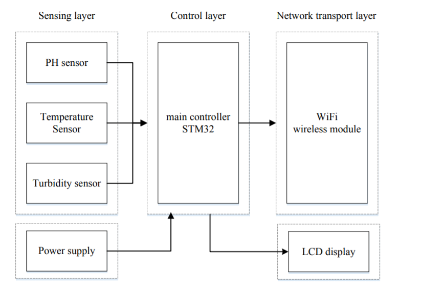
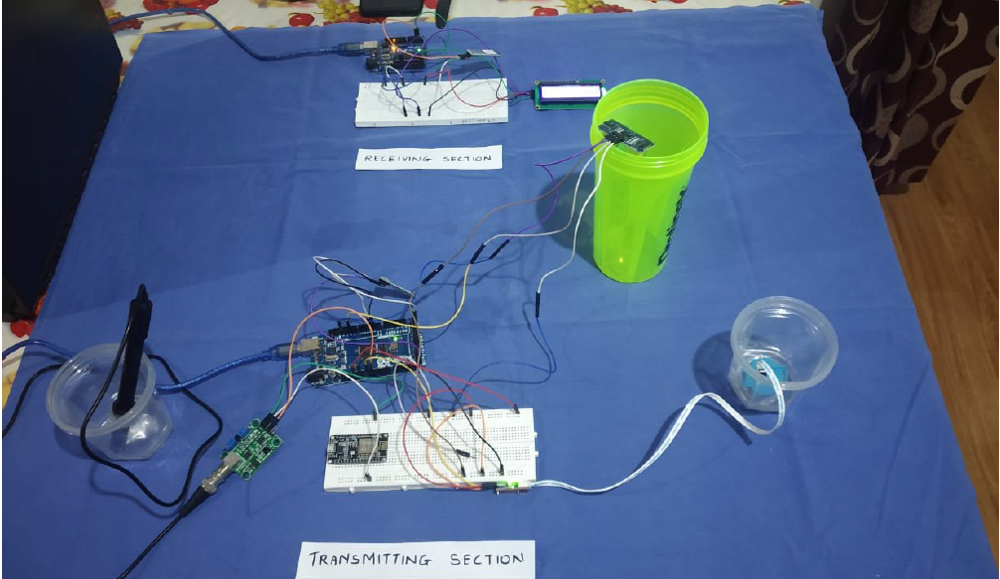

# IoT-Smart Water Quality Detection System
## Arduino Project
### Used 3 Sensors to detect the Quality of the water 
#### *Temperature Sensor (used Blynk app) 
#### *Turbidity Sensor
#### *pH Sensor
This Project can be used in houses, building tanks, wells, etc.

